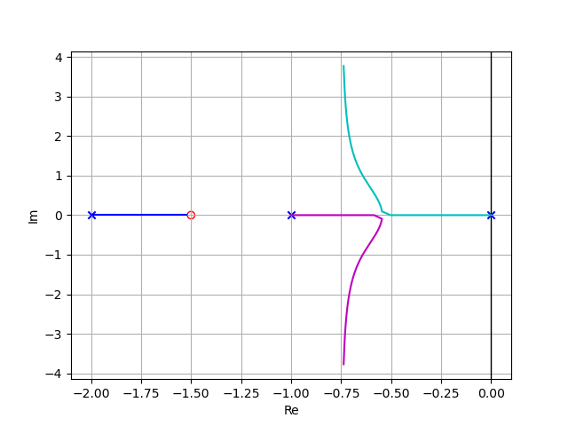

# Root Locus with Python

## Introduction
A python implementation of root locus. You can draw the **root locus** of a transfer function with gain K as a variable using the **commandline arguments**.

## Usage
Use the terminal to complete the plot.
- Enter the numerator coefficients of the open-loop transfer function after `--num`.
- Enter the denomonator coefficients of the open-loop transfer function after `--den`.
- If necessary, enter the max value of K after `--gain`. The default values of K are 0 to 15

Refer to the code below to draw the root locus:
```shell
python rootlocus.py --num 1 1.5 --den 1 3 2 0
```


You can also use `python rootlocus.py --help` to show the help message.
```
usage: rootlocus.py [-h] [--num NUM [NUM ...]] [--den DEN [DEN ...]] [--gain GAIN]

optional arguments:
  -h, --help           show this help message and exit
  --num NUM [NUM ...]  the numerator of the transfer function
  --den DEN [DEN ...]  the denominator of the transfer function
  --gain GAIN          the max value of gain K, default: 15
```

## License
[MIT](LICENSE) © Square Zhong

